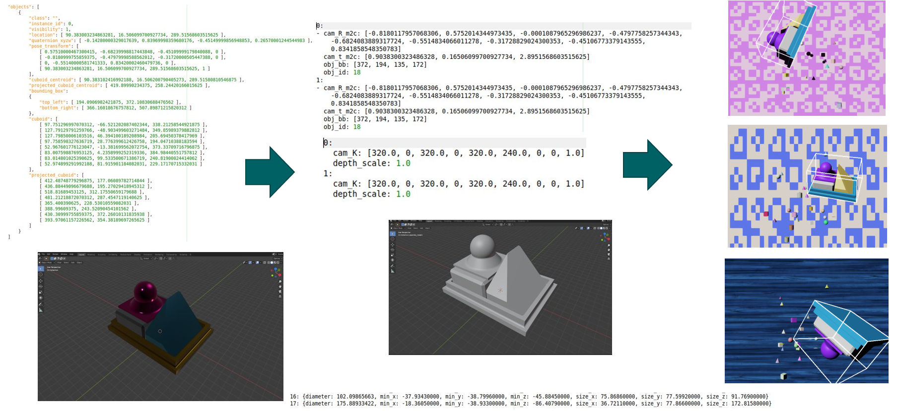

# Converting NDDS-Data to Occlusion Linemod
This repository can be used to easily convert the data generated with [NDDS](https://github.com/NVIDIA/Dataset_Synthesizer) to [preprocessed Linemod](https://github.com/ybkscht/EfficientPose).




## Installing the code
* Use conda to install the code
```bash
conda create -n nddsConvertor python=3.6
conda activate nddsConvertor
pip install -r requirements.txt
```
## Using the code
Just make sure that your data is sorted like the datasets/test and do run.py